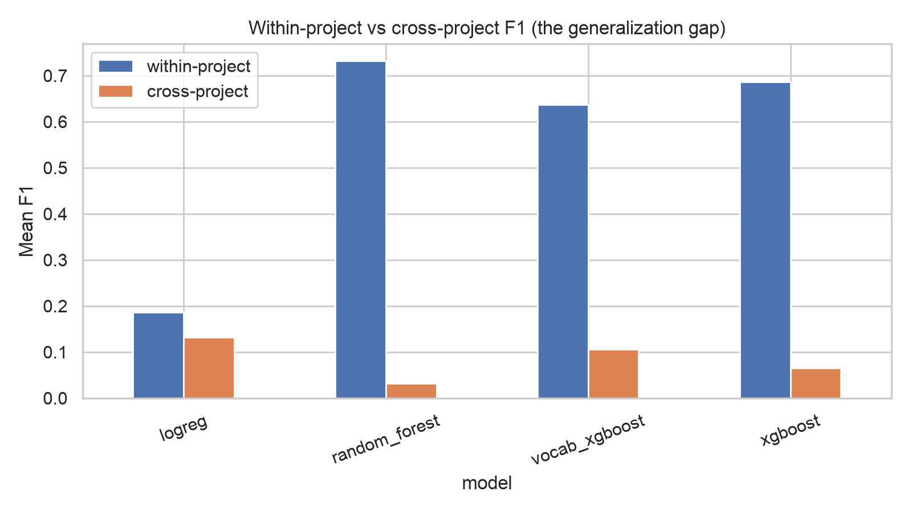

# flakeguard

**Predicting flaky tests without repeated execution** — a research pipeline and
CLI tool for flaky-test prediction, evaluated under the deployment scenario
that matters: projects the model has never seen.

[](https://github.com/omaryounesss/Flaky-Test-Prediction-diss/actions/workflows/ci.yml)


A *flaky test* passes and fails on identical code — its outcome depends on
timing, concurrency, network, the clock, or shared state rather than on the
code under test. Flaky failures erode trust in CI and waste engineering time,
and the reliable detector (rerunning every test hundreds of times) is far too
expensive to run continuously. This project treats flakiness as a supervised
classification problem over features of the test itself, and measures how far
that idea actually carries.

## Headline results

Evaluated on the [FlakeFlagger dataset](https://github.com/AlshammariA/FlakeFlagger)
(22,236 JUnit tests from 24 open-source Java projects, 811 flaky, labelled by
10,000 reruns per test):

Three evaluation protocols, in decreasing order of information shared
between training and test sets:

| | Mixed-project (pooled 5-fold CV) | Within-project (per-project CV) | Cross-project (leave-one-project-out) |
|---|---|---|---|
| Best F1 | **0.73** (random forest) | **0.61** mean / 0.69 median (random forest) | **0.13** (logistic regression) |
| Best ROC-AUC | 0.97 | 0.93 | 0.71 |

Restricted to the same 14 projects the within-project protocol uses, the
pooled protocol reaches 0.76 — so pooling alone is worth ≈0.15 F1 over
evaluating a repository on its own history.



Three findings:

1. **Where the model knows the project, prediction works.** F1 0.73 pooled /
   0.61 per-project, and 96–99% of the fifty highest-ranked tests are
   genuinely flaky — a near-pure triage list. (Note: most prior work reports
   the pooled protocol as "within-project"; on matched projects the pooling
   alone is worth ≈0.15 F1.)
2. **On unseen projects, it collapses** — and the collapse is structured:
   logistic regression significantly beats random forest across held-out
   projects (Wilcoxon p = 0.004). High-capacity models memorize
   project-specific signal that does not transfer.
3. **The strongest features are the least portable.** Ablations show dynamic
   features (execution time, coverage) drive know-the-project accuracy, while
   removing them *improves* mean cross-project transfer (better in 13 of 24
   held-out projects; suggestive rather than significant) — evidence that
   they fingerprint the project rather than the flakiness.

Full per-fold and per-project numbers, ablations, and significance tests are
in [`results/`](results/); every number regenerates from one command.

## Reproduce everything

```bash
git clone https://github.com/omaryounesss/Flaky-Test-Prediction-diss.git
cd Flaky-Test-Prediction-diss
make all        # venv + deps + data (~23 MB) + tests + experiments + SHAP + model
```

Requires Python 3.13 (and `brew install libomp` on macOS — `make setup`
handles it). Individual stages: `make setup`, `make data`, `make test`,
`make experiments` (~6 min, fixed seed 42), `make explain`, `make model`.
See [docs/how-to-run.md](docs/how-to-run.md) for the full manual and
troubleshooting.

## The tool

`flakeguard` scores the JUnit tests of **any Java repository** in seconds —
no build integration, no instrumentation:

```console
$ flakeguard scan path/to/repo
flakeguard: scored 3 tests [model]

  0.38  src/test/PaymentServiceTest.java::writesAuditLog
        - reads or writes the filesystem
        - depends on the current time
  0.26  src/test/PaymentServiceTest.java::retriesOnTimeout
        - waits on wall-clock time (Thread.sleep / await)
        - starts or coordinates concurrent work
        - talks to the network
  0.08  src/test/PaymentServiceTest.java::computesTotal
        - no specific risky pattern detected
```

Every score comes with plain-English reasons from nine risky-API detectors
(sleeps, threads, network, filesystem, randomness, system time, hash-order
dependence, mutable static state, timeouts). Under the hood: `@Test` methods
are extracted with a brace-matching parser, tokenized, and scored by a
TF-IDF + XGBoost model trained on the full dataset; SHAP attributions back
the explanation layer.

```bash
flakeguard scan . --format markdown     # GitHub Actions step summaries
flakeguard scan . --format json         # machine-readable
flakeguard scan . --fail-above 0.9      # CI gate: exit 1 if breached
```

**PR risk gate:** [`.github/workflows/flaky-risk-gate.yml`](.github/workflows/flaky-risk-gate.yml)
runs the scan on every pull request that touches test files and posts a
ranked risk report before merge. Scores are triage priorities, not verdicts —
scoring an unseen repo is exactly the cross-project setting, which is why the
honest framing above matters.

## Repository layout

```
src/flakeguard/       the package
  data.py             dataset loading, feature families
  modeling.py         imbalance-aware baselines (majority/logreg/RF/XGBoost)
  evaluation.py       mixed-, within-, and cross-project (LOPO) protocols
  vocab.py            token-vocabulary baseline
  explain.py          SHAP attributions -> human-readable risk reasons
  extract.py          static feature extraction from Java test source
  cli.py              flakeguard train / scan
experiments/          experiment runners (write results/)
results/              generated metrics tables and figures
tests/                pytest suite
docs/                 operating manual
examples/             sample Java test file (make demo)
```

## Method in brief

- **Features:** four families — test smells, size, dynamic signals (coverage,
  execution time, churn), and test-body token vocabulary.
- **Models:** majority-class floor, logistic regression, random forest,
  XGBoost; all class-weighted for the 3.6% positive rate. Accuracy is never
  reported (a constant classifier scores 96.4%).
- **Protocols:** pooled stratified 5-fold CV (mixed-project — the
  literature's default), per-project 5-fold CV (true within-project), and
  leave-one-project-out (the deployment scenario), with per-project class
  distributions, variance, and paired Wilcoxon significance tests.
- **Explainability:** TreeSHAP global importance plus per-test top-3 risk
  reasons mapped to a root-cause vocabulary.

## Dataset & acknowledgements

- **FlakeFlagger dataset:** Alshammari, Morris, Hilton, Bell —
  *FlakeFlagger: Predicting Flakiness Without Rerunning Tests* (ICSE 2021).
  https://github.com/AlshammariA/FlakeFlagger
- **IDoFT** (International Dataset of Flaky Tests):
  https://github.com/TestingResearchIllinois/idoft

Raw data files are not committed; `make data` fetches them (~23 MB).

## License

[MIT](LICENSE) — © 2026 Omar Younes.
